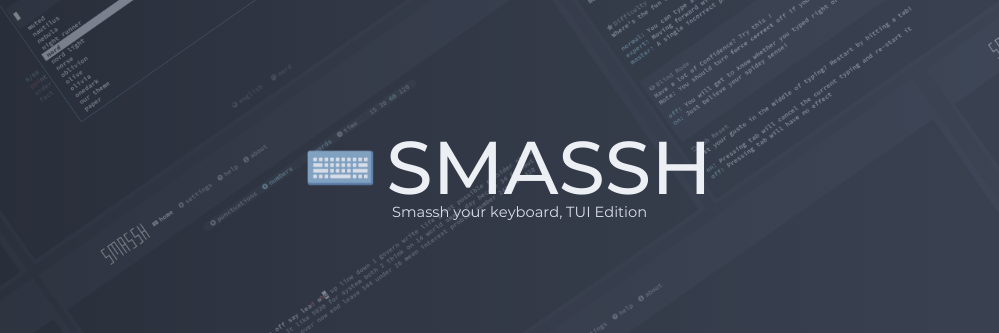
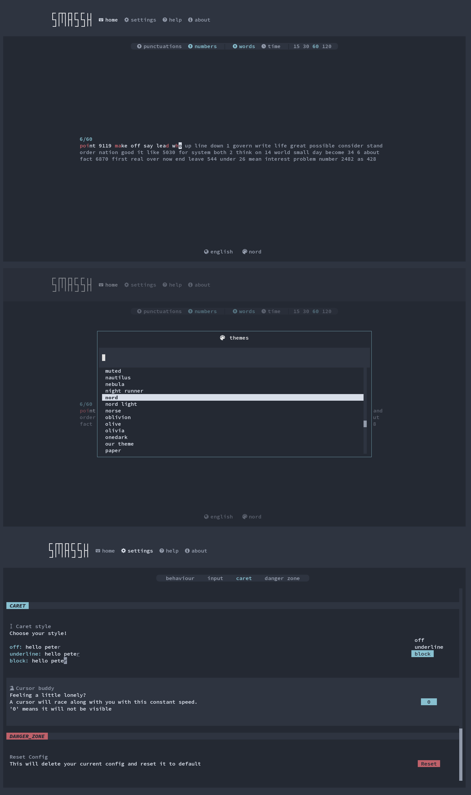

# Smassh 🖮

Smassh is a TUI based typing test application inspired by MonkeyType \
-- A very popular online web-based typing application

Smassh tries to be a full fledged typing test experience but not missing
out on looks and feel!

[](https://github.com/kraanzu/smassh/issues)
[](https://github.com/kraanzu/smassh/stargazers)
[](https://github.com/kraanzu/smassh/blob/main/LICENSE)
[](https://discord.gg/WA2ER9MBWa)

> [!CAUTION]
> Smassh, by default, uses [nerd fonts](https://www.nerdfonts.com/) for the icons
> If not installed, you'll see random gibberish icons

# Installation 🔨

## Using Pip 🐍

> You can install the stable version of smassh by using pip or [pipx](https://github.com/pypa/pipx)

```bash
pip install smassh
```

## Using AUR 📦

```
yay -S smassh
```

### Executable binary 🔌

You should be able to see binaries for `Linux`, `mac` and `windows` in the [releases section](https://github.com/kraanzu/smassh/releases)

> [!NOTE]
> This should automatically create an executable `smassh` that can be directly run from command line \
> If not, check if the local path is added to `$PATH`

# Features 🌟

> Some features that smassh comes with:

- An interactive & beautiful UI
- Words and Time modes for typing
- Real-time comparison of speed carets
- Change styles/settings on the fly
- Mutliple theme support
- Mutliple language support
- Lots of options to tweak!

# Tweaks ⚙️

| Tweak           | Description                                                                  |
| --------------- | :--------------------------------------------------------------------------- |
| Blind mode      | You wouldn't be able to see your mistakes                                    |
| Capital Letters | Some letters in your tasks will be capitalized!                              |
| Caret Style     | Caret style matters!                                                         |
| Confidence mode | Are you sure you don't need backspace? Try this :)                           |
| Cursor Buddy    | Setup your cursor buddy to run along with you!                               |
| Difficulty      | Choose how strict smassh should be with your wrong keypresses                |
| Force Correct   | You wouldn't be able to able to go on without cleaning your pool of mistakes |
| Min Accuracy    | Fall below this average accuracy and you fail!                               |
| Min Burst       | Fall below this average accuracy for even a word and you fail!               |
| Min Speed       | Fall below this average speed and you fail!                                  |
| Tab Reset       | Hey hey! You wanna reset already? I got ya!                                  |

# Screenshots 🖼️



# Contribution 🤝

See [CONTRIBUTING.md](CONTRIBUTING.md) for contributions

# Credits 
[@duwudle](https://github.com/duwudle) for the awesome banner \
[@miodec](https://github.com/Miodec) for monkeytype!

# Other TUI projects 🤓 :

If you liked smassh then you might wanna try out some of my other TUI projects as well

- [dooit](https://github.com/kraanzu/dooit) - A todo app that you didn't ask for but needed!
- [gupshup](https://github.com/kraanzu/gupshup) - A localhost TUI chat client
